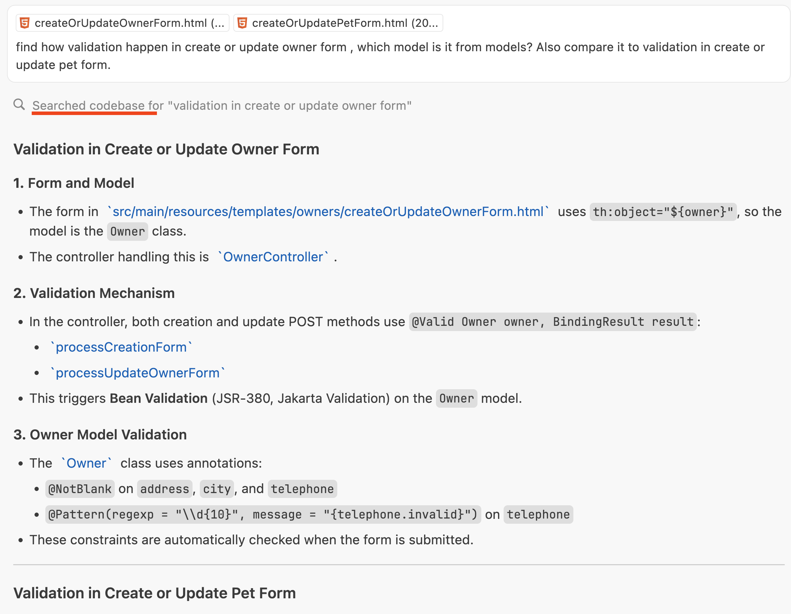
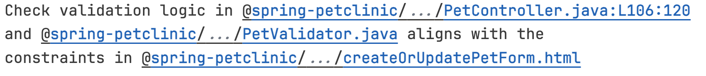
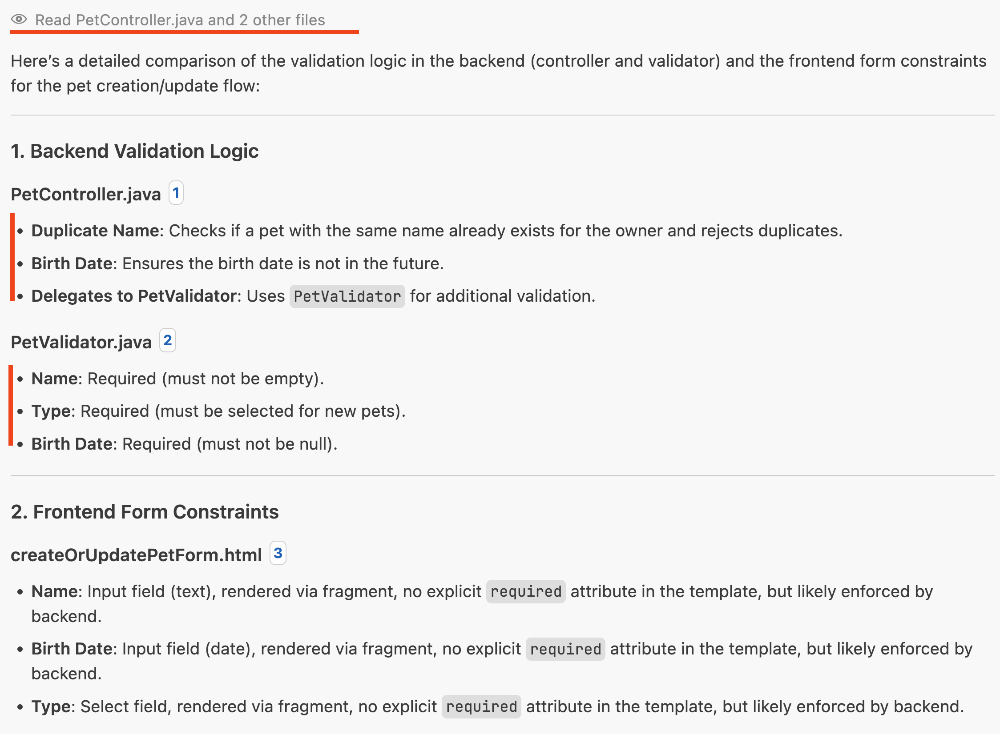

# InContext

  

**Prompt the right way. Structure your AI prompts naturally, with inline, pinpoint-accurate code references — delivering better LLM outputs, preserving your visual context, and enabling logical, easy-to-read prompts.**

---

## 🚀 Features

- **Inline, Clickable Code References:** Instantly copy and share references to files, folders, or code ranges in your workspace, using the `@project/path/to/file:L10:20` format.
- **Beautiful Inline Feedback:** When you copy a reference, a large, styled inline message (`Reference added to clipboard!`) appears next to your selection or cursor, with a border and padding for clarity.
- **Explorer & Editor Integration:** Copy references from the editor or the file/folder context menu in the Explorer.
- **Hover Previews:** Hover over a reference to preview code or see folder contents.
- **Keyboard Shortcuts:** Use <kbd>Cmd</kbd>+<kbd>'</kbd> to copy references quickly.
- **No intrusive popups:** All feedback is inline and non-blocking.

---

## 🛠️ Usage

### Copy a Code Reference

- **From the Editor:**
  - Select code, right-click, and choose **Copy Code Reference to Clipboard** (or press <kbd>Cmd</kbd>+<kbd>'</kbd>).
  - If no selection, copies a reference to the current file.
  - An inline message will appear: Reference added to clipboard!

- **From the Explorer:**
  - Right-click a file or folder and choose **Copy File Reference** or **Copy Directory Reference**.

### Paste the Reference

- Paste anywhere: in markdown, code comments, prompts, or chat tools. The reference is clickable and will open the file/lines in VS Code.

### Hover for Preview

- Hover over a reference to preview code or see folder contents inline.

---

## 📦 Installation

1. Download the latest `.vsix` file from your build (e.g., `incontext-1.0.1.vsix`).
2. In VS Code, open the Command Palette (<kbd>Cmd</kbd>+<kbd>Shift</kbd>+<kbd>P</kbd>), type `Extensions: Install from VSIX...`, and select your `.vsix` file.
3. Reload VS Code if prompted.

---

## 📝 Changelog

- **1.0.1**
  - Added large, styled inline decoration for copy feedback (with border and padding)
  - Improved keyboard shortcuts and context menu integration
  - Enhanced hover previews for code and folders
  - Bug fixes and polish

---

## 🔑 Why This Matters

When crafting AI prompts, structure is everything. Traditional prompts that dump all context at the top, or attach files separately, confuse both humans and AI.

InContext lets you write prompts the way you think and communicate:

* You say "Look at this..."
* The relevant code reference follows naturally, inline.
* LLMs understand that "this" points precisely to the lines or file you reference—no ambiguity.
* This results in:
  * More accurate, reliable AI outputs.
  * Pinpoint control over what the LLM focuses on.
  * Logical, English-like prompts that flow naturally.

**This isn't just beautiful formatting—it's the correct, structured way to write prompts that maximize AI performance.**

By embedding references inline, in logical order, you:

* Give the LLM precise, localized context exactly where it's needed.
* Avoid forcing the AI to "guess" from a giant, scattered context block.
* Write better prompts, get better results.

---

**Why the New Way Wins:**

The new InContext prompting style gives you—and your AI—spatial awareness: you write prompts naturally, referencing code inline, exactly where it matters. This keeps you (the developer) in flow, lets you express your intent in logical, English-like order, and ensures the LLM receives precise, localized context. By crafting prompts with **surgical precision**, you make them not only easier for yourself to read and reason about, but also enable the LLM to interpret your intent and context with the same level of accuracy. The result? Dramatically higher quality, more accurate outputs. You get answers that are not only easier to verify, but also more relevant—because both you and the AI are always looking at the right code, at the right time.

## 🖼️ Example

Below is a real-world example showing the difference between the old and new ways of providing context to an LLM, using screenshots from the Spring Petclinic project:

### Old way: LLM-Driven Search & Synthesis

- The LLM receives a high-level question and performs a semantic search across the codebase.
- It guesses which files are relevant and synthesizes an answer based on search results.
- The answer is often general, referencing files and classes, but not always pointing to exact lines.
- The process can be slower and less precise, especially if the search misses a key file or context.

### New Way: Explicit Context Injection
#### Prompt with InContext 🧘🏼‍♂️
  

#### Result 👌
  

- The user (or system) directly attaches the relevant files and line ranges to the LLM's context.
- The LLM immediately has access to the exact code needed for the answer.
- The answer can reference specific files and line numbers with precision.
- The process is faster and more reliable, as it avoids unnecessary searching.

#### **Key Benefits of the New Way**
- **Precision:** Answers reference exact files and line numbers, making navigation easy.
- **Efficiency:** No time wasted on searching or sifting through irrelevant results.
- **Reliability:** Reduces the risk of missing important context or making incorrect assumptions.
- **User Experience:** Users get actionable, context-rich answers that are easy to verify and follow up on.

> **Best Practice:**
> Whenever possible, provide the LLM with the exact files and line ranges relevant to the question. This enables the LLM to deliver answers that are both accurate and immediately useful, especially for code navigation and review tasks.

---

## ✨ Why the New Way is Better

- **Pinpoint Accuracy & Surgical Precision:** Every claim is backed by a direct, clickable reference to the codebase, often with line numbers. Prompts are crafted with surgical precision, benefiting both human readers and the LLM.
- **Instant Verification:** You can check any statement by clicking the link—no more manual searching.
- **Always Up-to-Date:** Answers are grounded in the current code, not memory or guesswork.
- **Superior Collaboration:** Share prompts and answers with teammates; everyone can instantly navigate to the relevant code.
- **Cleaner Prompts:** Inline references keep your visual context clean and logical, making prompts easier to write, read, and reuse.

**InContext is the right way to write prompts—maximizing AI performance, developer confidence, and team productivity.**

---

### 💡 Inspired by WindSurf

The inspiration for this type of prompting came from **WindSurf IDE**, which introduced the idea of connecting code context to prompts.

### 🌐 Flexible, Universal Usage

* You can embed these references **anywhere** — in `.txt` files, `.md` files, code comments, documentation, AI prompts, or chat tools.
* References are fully **clickable**, regardless of file type.
* Great for connecting different parts of your codebase with in-code, bidirectional links.
* Ideal for enhancing documentation, linking to other files with precise, interactive references.
* Share prompts with your team, preserving full click-through context for consistent collaboration.

### 💡 This is the right way to write prompts.

Stop forcing rigid "context blocks" and losing clarity. Start writing naturally—with precise, inline references that:

* Preserve your visual context.
* Provide AI with correct, ordered, logical knowledge.
* Give your prompts pinpoint, localized context.
* Improve AI output quality.
* Keep your workspace clean, navigable, and intuitive.
* Create reusable, shareable, context-rich prompts for your team.

